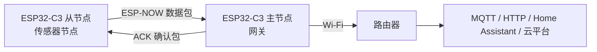
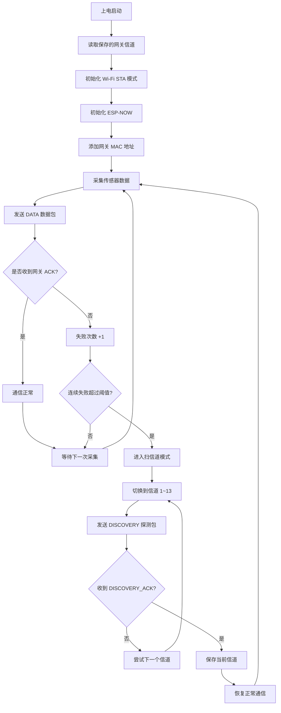
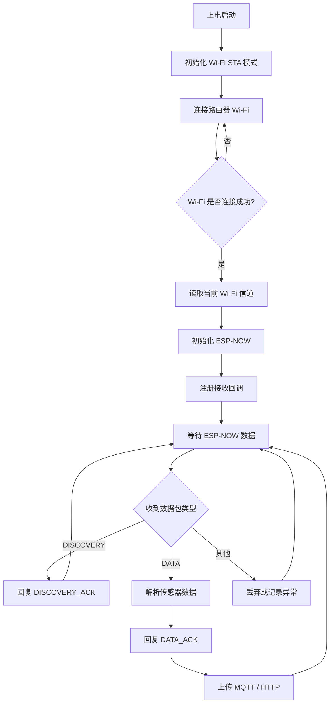
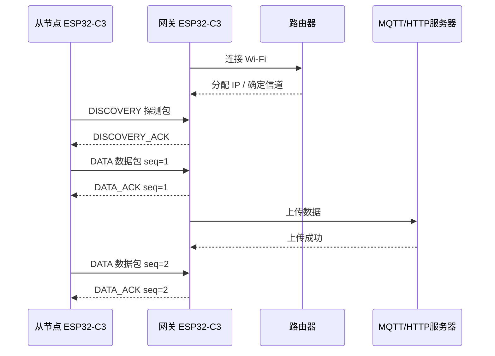
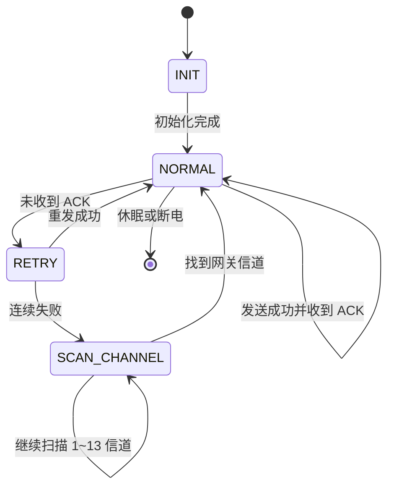

# ESP32-C3 ESP-NOW 主从节点工作流

## 整体架构图

## 从节点工作流

## 网关工作流

## 通信时序图

## 状态机图

## 核心逻辑

从节点：采集数据 -> 发送给网关 -> 等待 ACK -> 失败则重发 -> 多次失败则扫信道。

网关：连接 Wi-Fi -> 初始化 ESP-NOW -> 接收数据 -> 回复 ACK -> 上传服务器。

这个设计适合 Wi-Fi 重启、路由器信道变化、墙体干扰等场景，比单向发送更稳定。
